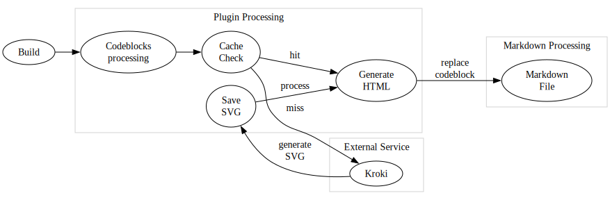
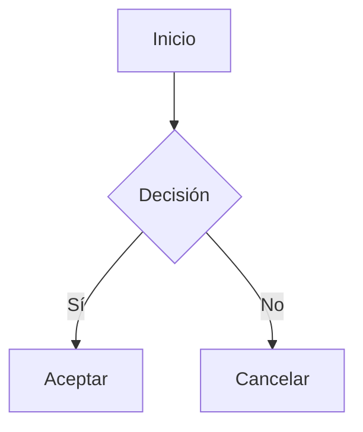

# VitePress Diagrams Plugin

[English](README.md) | [Español](README.es.md) | [中文](README.zh.md) | [Українська](README.uk.md) | [Русский](README.ru.md)

Un plugin de VitePress que agrega soporte para varios tipos de diagramas utilizando el servicio Kroki. El plugin convierte automáticamente los bloques de código de diagramas en imágenes SVG, los almacena en caché localmente y proporciona una visualización limpia y personalizable con subtítulos opcionales.

El uso de un servicio externo requiere una conexión a Internet durante la compilación, pero ofrece ventajas significativas sobre la creación de imágenes en el cliente (gran tamaño del paquete y caída del rendimiento) y sobre la creación de imágenes en el servidor (complejidad - mermaid requiere puppeteer para esto, por ejemplo).

Los diagramas están diseñados para ser generados en el tiempo __DEV__ debido a:

1. El proceso de generación es asíncrono.
2. No es 100% confiable (por ejemplo, el servicio kroki.io podría estar caído).
3. El usuario necesita verificar la salida.

 > El CLI `vitepress-plugin-diagrams` que viene con este paquete puede ser usado en un CI para comprobar si faltan diagramas o si están desactualizados. También hay un hook [pre-commit](https://pre-commit.com) disponible (ver [sección pre-commit](#pre-commit-usage)).

## Características

- Soporta múltiples tipos de diagramas (Mermaid, PlantUML, GraphViz y más)
- Generación automática de SVG con caché (una vez generado, se almacena localmente hasta que cambie el código del diagrama)
- Subtítulos opcionales para diagramas
- Directorios de salida personalizables
- Salida HTML limpia y semántica
- Posibilidad de usar cualquier editor para crear diagramas (por ejemplo, VS Code con extensión Mermaid)



## Instalación

```bash
pnpm add -D vitepress-plugin-diagrams
```

<details>
<summary>yarn</summary>

```bash
yarn add -D vitepress-plugin-diagrams
```
</details>

<details>
<summary>npm</summary>

```bash
npm install --save-dev vitepress-plugin-diagrams
```
</details>

## Inicio Rápido

1. Agregar a la configuración de VitePress (`.vitepress/config.ts`):

```ts
import { defineConfig } from "vitepress";
import { configureDiagramsPlugin } from "vitepress-plugin-diagrams";

export default defineConfig({
  markdown: {
    config: (md) => {
      configureDiagramsPlugin(md, {
        diagramsDir: "docs/public/diagrams", // Opcional: directorio personalizado para archivos SVG
        publicPath: "/diagrams", // Opcional: ruta pública personalizada para imágenes
        krokiServerUrl: "https://kroki.io", // Opcional: URL del servidor Kroki
        excludedDiagramTypes: ["mermaid"], // Opcional: excluir tipos de diagramas específicos
      });
    },
  },
});
```

2. Crear diagramas en markdown:

````

<!-- diagram id="1" caption: "Diagrama de flujo del sistema" -->
````

## Metadatos de Diagramas

La función de metadatos de diagramas proporciona contexto e identificación adicional. Puede agregar metadatos a sus diagramas utilizando comentarios HTML especiales.

```html
<!-- diagram id="1" caption: "Diagrama de flujo del sistema" -->
```

- Asignar un ID único a cada diagrama para prevenir la saturación de caché (opcional, si no modifica y regenera diagramas)
- Agregar descripciones explicativas debajo del diagrama (opcional)

Nota sobre identificadores:

- Si omite `id`, el plugin deriva automáticamente un identificador estable basado en la posición (`positionId`) a partir del nombre del archivo markdown y el índice del bloque de código. Esto mantiene estables los nombres de archivo entre reconstrucciones, a menos que el diagrama se mueva dentro del archivo.
- Si no se puede usar ni `id` ni la posición, el nombre del archivo vuelve a una forma basada solo en el hash del contenido.

## Diagramas Soportados

Mermaid, PlantUML, GraphViz, BlockDiag, BPMN, Bytefield, SeqDiag, ActDiag, NwDiag, PacketDiag, RackDiag, C4 (con PlantUML), D2, DBML, Ditaa, Erd, Excalidraw, Nomnoml, Pikchr, Structurizr, Svgbob, Symbolator, TikZ, UMlet, Vega, Vega-Lite, WaveDrom, WireViz

[Ver lista completa de diagramas soportados →](https://kroki.io/#support)

## Configuración

| Opción        | Tipo     | Valor predeterminado     | Descripción                                      |
|---------------|----------|--------------------------|--------------------------------------------------|
| `diagramsDir` | `string` | `"docs/public/diagrams"` | Directorio donde se almacenarán los archivos SVG |
| `publicPath`  | `string` | `"/diagrams"`            | Ruta pública para acceder a los archivos         |
| `krokiServerUrl` | `string` | `"https://kroki.io"` | URL del servidor Kroki para generar diagramas |
| `excludedDiagramTypes` | `DiagramType[]` | `[]` | Tipos de diagramas a excluir; estos bloques se renderizan como código normal |

## Estructura de Salida

```html
<figure class="vpd-diagram vpd-diagram--[diagramType]">
  
  <figcaption class="vpd-diagram-caption">
    [caption]
  </figcaption>
</figure>
```

Puede personalizar las clases `CSS` para que coincidan con su tema.

### Patrón de nombre de archivo y comportamiento de caché

- El formato del nombre de archivo varía según los identificadores disponibles:
  - Con `id` explícito: `[diagramType]-[id]-[hash].svg`
  - Con identificador basado en posición: `[diagramType]-[positionId]-[hash].svg`
  - Sin identificador: `[diagramType]-[hash].svg`
- Los archivos antiguos se limpian automáticamente al regenerar:
  - Con `id`, se eliminan los archivos anteriores con el mismo `diagramType` y `id`.
  - Con `positionId`, se eliminan los archivos anteriores con el mismo `diagramType` y `positionId`.
  - Sin identificadores, los archivos `[diagramType]-[otherHash].svg` se eliminan cuando cambia el contenido.

## Pre-commit

Añade esto a tu `.pre-commit-config.yaml`:

```yaml
- repo: https://github.com/vuesence/vitepress-plugin-diagrams
  rev: "main"
  hooks:
    - id: check-missing-diagrams
    - id: clean-diagrams
```

## Nota

Cuando actualiza una diagrama, puede ver un placeholder imagen en la página del navegador. Esto es normal, porque el archivo svg se carga de forma asíncrona y puede no mostrarse inmediatamente. Simplemente actualice la página.

## Licencia

MIT

## Contribuciones

¡Las contribuciones son bienvenidas! Antes de enviar un Pull Request, por favor abra un issue para discutir los cambios propuestos.

## Créditos

Este plugin utiliza el servicio [Kroki](https://kroki.io/) para la generación de diagramas.
