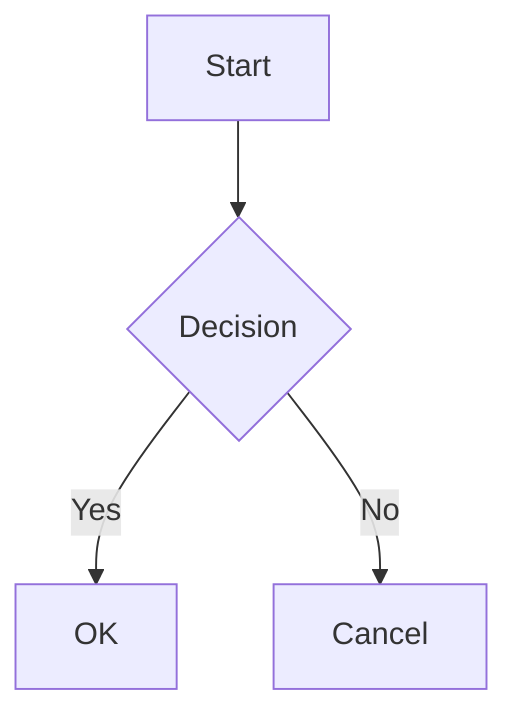

# VitePress Diagrams Plugin

[English](README.md) | [Español](README.es.md) | [中文](README.zh.md) | [Українська](README.uk.md) | [Русский](README.ru.md)

A VitePress plugin that adds support for various diagram types using the Kroki service. The plugin automatically converts diagram code blocks into SVG images, caches them locally, and provides a clean, customizable display with optional captions.


Using an external service requires an internet connection during build, but it offers significant advantages over creating an image on the client (huge bundle and performance drop) and over creating an image on the server (complexity - mermaid requires puppeteer for this, for example).

The diagrams are meant to be generated at __DEV time__ because:

1. The generation process is asynchronous.
2. It’s not 100% reliable (e.g., kroki.io service might be down).
3. The user needs to verify the output.

> The `vitepress-plugin-diagrams` CLI that comes bundled with this package can be used in a CI to check for missing diagrams or outdated ones. There is also a [pre-commit](https://pre-commit.com) hook available (see [pre-commit section](#pre-commit)).

## Features

- Supports multiple diagram types (Mermaid, PlantUML, GraphViz, and more)
- Automatic SVG generation and caching (once generated it's cached locally until the diagram code changes)
- Optional diagram captions
- Customizable output directory and public path
- Clean, semantic HTML output
- Use can use any editor to create diagrams (for example `VS Code` with `Mermaid` extension)


## Installation

```bash
pnpm add -D vitepress-plugin-diagrams
```

<details>
<summary>yarn</summary>

```bash
yarn add -D vitepress-plugin-diagrams
```
</details>

<details>
<summary>npm</summary>

```bash
npm install --save-dev vitepress-plugin-diagrams
```
</details>

## Quick Start

1. Add to VitePress config (`.vitepress/config.ts`):

```ts
import { defineConfig } from "vitepress";
import { configureDiagramsPlugin } from "vitepress-plugin-diagrams";

export default defineConfig({
  markdown: {
    config: (md) => {
      configureDiagramsPlugin(md, {
        diagramsDir: "docs/public/diagrams", // Optional: custom directory for SVG files
        publicPath: "/diagrams", // Optional: custom public path for images
        krokiServerUrl: "https://kroki.io", // Optional: custom Kroki server URL
      });
    },
  },
});
```

2. Create diagrams in markdown:

````

<!-- diagram id="1" caption: "System Design Flow" -->
````

## Diagram Metadata

The diagram metadata feature provides additional context and identification. You can add metadata to your diagrams using special HTML comments.

```html
<!-- diagram id="1" caption: "System Design Flow" -->
```

- Assign a unique ID to each diagram to prevent cache bloating (optional, if you do not modify and regenerate diagrams)
- Add descriptive captions under the diagram (optional)

## Supported Diagrams

Mermaid, PlantUML, GraphViz, BlockDiag, BPMN, Bytefield, SeqDiag, ActDiag, NwDiag, PacketDiag, RackDiag, C4 (with PlantUML), D2, DBML, Ditaa, Erd, Excalidraw, Nomnoml, Pikchr, Structurizr, Svgbob, Symbolator, TikZ, UMlet, Vega, Vega-Lite, WaveDrom, WireViz

[View full list of supported diagrams →](https://kroki.io/#support)

## Configuration

| Option        | Type     | Default                  | Description                              |
|---------------|----------|--------------------------|------------------------------------------|
| `diagramsDir` | `string` | `"docs/public/diagrams"` | Directory where SVG files will be stored |
| `publicPath` | `string` | `"/diagrams"` | Public path for accessing the SVG files |
| `krokiServerUrl` | `string` | `"https://kroki.io"` | Kroki server URL for diagram generation |

## Output

## Output Structure

```html
<figure class="vpd-diagram vpd-diagram--[diagramType]">
  
  <figcaption class="vpd-diagram-caption">
    [caption]
  </figcaption>
</figure>
```

You can customize the `CSS` classes to match your theme.

## Note

When updating a diagram, you may see a placeholder image on the browser page. This is normal, because the svg file is loaded asynchronously and may not be displayed immediately. Just refresh the page.

## Pre-commit

Add this to your `.pre-commit-config.yaml`:

```yaml
- repo: https://github.com/vuesence/vitepress-plugin-diagrams
  rev: "main"
  hooks:
    - id: check-missing-diagrams
    - id: clean-diagrams
```

## License

MIT

## Contributing

Contributions are welcome! Before submitting a Pull Request, please open an issue first to discuss proposed changes.

## Credits

This plugin uses the [Kroki](https://kroki.io/) service for diagram generation.
