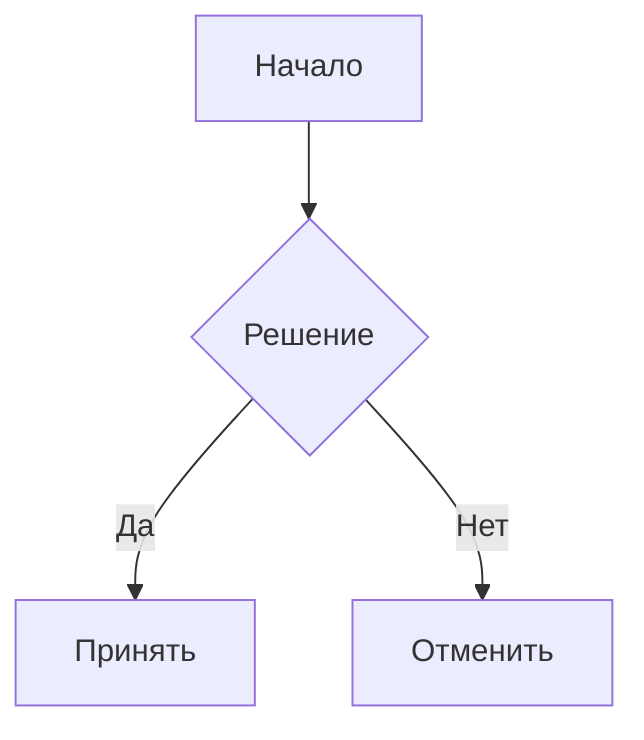

# Плагин диаграмм для VitePress

[English](README.md) | [Español](README.es.md) | [中文](README.zh.md) | [Українська](README.uk.md) | [Русский](README.ru.md)

Плагин VitePress, добавляющий поддержку различных типов диаграмм с использованием сервиса Kroki. Плагин автоматически преобразует блоки кода диаграмм в SVG-изображения, кэширует их локально как файлы и обеспечивает семантическое, стилизуемое отображение с опциональными подписями (captions).

Использование внешнего сервиса требует подключения к Интернету во время сборки, но предоставляет значительные преимущества по сравнению с созданием изображения на клиенте (огромный бандл и падение производительности) и созданием изображения на сервере (сложность - mermaid требует puppeteer для этого, например).

## Возможности

- Поддержка множества типов диаграмм (Mermaid, PlantUML, GraphViz и другие)
- Автоматическая генерация SVG с кэшированием (после генерации кэшируется локально до изменения кода диаграммы)
- Опциональные подписи к диаграммам
- Настраиваемые пути вывода
- Чистый, семантический HTML-вывод
- Возможность использования любого редактора для создания диаграмм (например, VS Code с расширением Mermaid)


## Установка

```bash
pnpm add -D vitepress-plugin-diagrams
```

<details>
<summary>yarn</summary>

```bash
yarn add -D vitepress-plugin-diagrams
```
</details>

<details>
<summary>npm</summary>

```bash
npm install --save-dev vitepress-plugin-diagrams
```
</details>

## Быстрый старт

1. Добавьте в конфигурацию VitePress (`.vitepress/config.ts`):

```ts
import { defineConfig } from "vitepress";
import { configureDiagramsPlugin } from "vitepress-plugin-diagrams";

export default defineConfig({
  markdown: {
    config: (md) => {
      configureDiagramsPlugin(md, {
        diagramsDir: "docs/public/diagrams", // Опционально: пользовательская директория для SVG файлов
        publicPath: "/diagrams", // Опционально: пользовательский публичный путь для изображений
      });
    },
  },
});
```

2. Создавайте диаграммы в markdown:

````

<!-- diagram id="1" caption: "Диаграмма потока системы" -->
````

## Метаданные диаграмм

Функция метаданных диаграмм предоставляет дополнительный контекст и идентификацию. Вы можете добавлять метаданные к своим диаграммам, используя специальные HTML-комментарии.

```html
<!-- diagram id="1" caption: "Диаграмма потока системы" -->
```

- Назначение уникального ID каждой диаграмме для предотвращения переполнения кэша (необязательно, если вы не изменяете и не regenerируете диаграммы)
- Добавление пояснительных описаний под диаграммой (необязательно) 

## Поддерживаемые диаграммы

Mermaid, PlantUML, GraphViz, BlockDiag, BPMN, Bytefield, SeqDiag, ActDiag, NwDiag, PacketDiag, RackDiag, C4 (с PlantUML), D2, DBML, Ditaa, Erd, Excalidraw, Nomnoml, Pikchr, Structurizr, Svgbob, Symbolator, TikZ, UMlet, Vega, Vega-Lite, WaveDrom, WireViz

[Посмотреть полный список поддерживаемых диаграмм →](https://kroki.io/#support)

## Конфигурация

| Опция | Тип | По умолчанию | Описание |
|--------|------|---------|-------------|
| `diagramsDir` | `string` | `"docs/public/diagrams"` | Директория для хранения SVG файлов |
| `publicPath` | `string` | `"/diagrams"` | Публичный путь для доступа к файлам |

## Структура вывода

```html
<figure class="vpd-diagram vpd-diagram--[diagramType]">
  
  <figcaption class="vpd-diagram-caption">
    [caption]
  </figcaption>
</figure>
```

Вы можете настроить классы `CSS` в соответствии с вашей темой.

## Замечание

При обновлении диаграммы вы можете увидеть ошибку на странице в браузере. Это нормально, потому что svg файл загружается асинхронно и может не отобразиться сразу.

## Лицензия

MIT

## Содействие

Мы приветствуем вклад в развитие проекта. Перед отправкой Pull Request, пожалуйста, создайте issue для обсуждения предлагаемых изменений.

## Благодарности

Этот плагин использует сервис [Kroki](https://kroki.io/) для генерации диаграмм. 