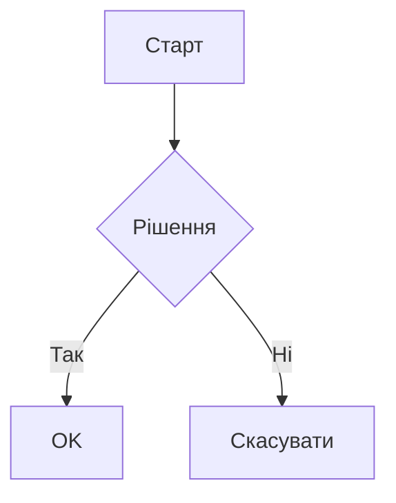

# VitePress Diagrams Plugin

[English](README.md) | [Español](README.es.md) | [中文](README.zh.md) | [Українська](README.uk.md) | [Русский](README.ru.md)

Плагін VitePress, який додає підтримку різних типів діаграм за допомогою сервісу Kroki. Плагін автоматично перетворює блоки коду діаграм у SVG-зображення, кешує їх локально та забезпечує чисте, налаштовуване відображення з опціональними підписами.

Використання зовнішнього сервісу вимагає підключення до Інтернету під час збірки, але надає значні переваги порівняно зі створенням зображення на клієнті (величезний бандл і падіння продуктивності) та створенням зображення на сервері (складність - mermaid потребує puppeteer для цього, наприклад).

## Можливості

- Підтримка багатьох типів діаграм (Mermaid, PlantUML, GraphViz та інші)
- Автоматична генерація SVG з кешуванням (після генерації кешується локально до зміни коду діаграми)
- Опціональні підписи до діаграм
- Налаштовувані шляхи виводу
- Чистий, семантичний HTML-вивід
- Можливість використання будь-якого редактора для створення діаграм (наприклад, VS Code з розширенням Mermaid)

## Встановлення

```bash
pnpm add -D vitepress-plugin-diagrams
```

<details>
<summary>yarn</summary>

```bash
yarn add -D vitepress-plugin-diagrams
```
</details>

<details>
<summary>npm</summary>

```bash
npm install --save-dev vitepress-plugin-diagrams
```
</details>

## Швидкий старт

1. Додайте до конфігурації VitePress (`.vitepress/config.ts`):

```ts
import { defineConfig } from "vitepress";
import { configureDiagramsPlugin } from "vitepress-plugin-diagrams";

export default defineConfig({
  markdown: {
    config: (md) => {
      configureDiagramsPlugin(md, {
        diagramsDir: "docs/public/diagrams", // Опціонально: користувацька директорія для SVG файлів
        publicPath: "/diagrams", // Опціонально: користувацький публічний шлях для зображень
      });
    },
  },
});
```

2. Створюйте діаграми в markdown:

````

<!-- diagram-caption: Приклад блок-схеми -->
````

## Підтримувані діаграми

Mermaid, PlantUML, GraphViz, BlockDiag, BPMN, Bytefield, SeqDiag, ActDiag, NwDiag, PacketDiag, RackDiag, C4 (з PlantUML), D2, DBML, Ditaa, Erd, Excalidraw, Nomnoml, Pikchr, Structurizr, Svgbob, Symbolator, TikZ, UMlet, Vega, Vega-Lite, WaveDrom, WireViz

[Переглянути повний список підтримуваних діаграм →](https://kroki.io/#support)

## Конфігурація

| Опція | Тип | За замовчуванням | Опис |
|--------|------|---------|-------------|
| `diagramsDir` | `string` | `"docs/public/diagrams"` | Директорія для зберігання SVG файлів |
| `publicPath` | `string` | `"/diagrams"` | Публічний шлях для доступу до файлів |

## Структура виводу

```html
<figure class="vpd-diagram vpd-diagram--[diagramType]">
  
  <figcaption class="vpd-diagram-caption">
    [caption]
  </figcaption>
</figure>
```

Ви можете налаштувати класи `CSS` відповідно до вашої теми.

## Ліцензія

MIT

## Співпраця

Ми вітаємо внесок у розвиток проекту! Перед відправкою Pull Request, будь ласка, створіть issue для обговорення запропонованих змін.

## Подяки

Цей плагін використовує сервіс [Kroki](https://kroki.io/) для генерації діаграм. 