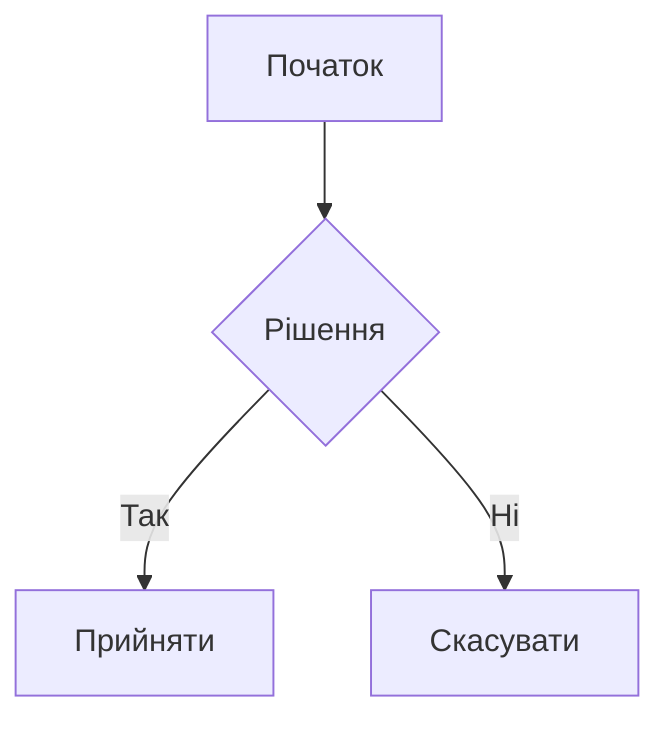

# VitePress Плагін діаграм

[English](README.md) | [Español](README.es.md) | [中文](README.zh.md) | [Українська](README.uk.md) | [Русский](README.ru.md)

Плагін VitePress, який додає підтримку різних типів діаграм за допомогою сервісу Kroki. Плагін автоматично перетворює блоки коду діаграм у SVG-зображення, кешує їх локально та забезпечує чисте, налаштовуване відображення з опціональними підписами.

Використання зовнішнього сервісу вимагає підключення до Інтернету під час збірки, але надає значні переваги порівняно зі створенням зображення на клієнті (величезний бандл і падіння продуктивності) та створенням зображення на сервері (складність - mermaid потребує puppeteer для цього, наприклад).

Діаграми призначені для генерації під час __DEV часу__ через:

1. Процес генерації є асинхронним.
2. Він не є 100% надійним (наприклад, сервіс kroki.io може бути недоступним).
3. Користувач повинен перевірити вивід.

> За допомогою `vitepress-plugin-diagrams` CLI, що постачається у комплекті з цим пакунком, можна перевірити наявність відсутніх або застарілих діаграм у CI. Також доступний гачок [pre-commit](https://pre-commit.com) (див. розділ [pre-commit](#pre-commit)).

## Можливості

- Підтримка багатьох типів діаграм (Mermaid, PlantUML, GraphViz та інші)
- Автоматична генерація SVG з кешуванням (після генерації кешується локально до зміни коду діаграми)
- Опціональні підписи до діаграм
- Налаштовувані шляхи виводу
- Чистий, семантичний HTML-вивід
- Можливість використання будь-якого редактора для створення діаграм (наприклад, VS Code з розширенням Mermaid)


## Встановлення

```bash
pnpm add -D vitepress-plugin-diagrams
```

<details>
<summary>yarn</summary>

```bash
yarn add -D vitepress-plugin-diagrams
```
</details>

<details>
<summary>npm</summary>

```bash
npm install --save-dev vitepress-plugin-diagrams
```
</details>

## Швидкий старт

1. Додайте до конфігурації VitePress (`.vitepress/config.ts`):

```ts
import { defineConfig } from "vitepress";
import { configureDiagramsPlugin } from "vitepress-plugin-diagrams";

export default defineConfig({
  markdown: {
    config: (md) => {
      configureDiagramsPlugin(md, {
        diagramsDir: "docs/public/diagrams", // Опціонально: користувацька директорія для SVG файлів
        publicPath: "/diagrams", // Опціонально: користувацький публічний шлях для зображень
        krokiServerUrl: "https://kroki.io", // Опціонально: URL сервера Kroki
      });
    },
  },
});
```

2. Створення діаграм у markdown:

````

<!-- diagram id="1" caption: "Діаграма потоку системи" -->
````

## Метадані діаграм

Функція метаданих діаграм надає додатковий контекст та ідентифікацію. Ви можете додавати метадані до своїх діаграм, використовуючи спеціальні HTML-коментарі.

```html
<!-- diagram id="1" caption: "Діаграма потоку системи" -->
```

- Призначення унікального ID кожній діаграмі для запобігання переповненню кешу (необов'язково, якщо ви не змінюєте та не regenerуєте діаграми)
- Додавання пояснювальних описів під діаграмою (необов'язково)

Примітка щодо ідентифікаторів:

- Якщо ви опустите `id`, плагін автоматично визначає стабільний ідентифікатор на основі позиції (`positionId`) з назви markdown-файлу та індексу блоку коду. Це зберігає стабільність імен файлів між перебудовами, якщо діаграма не переміщується всередині файлу.
- Якщо не можна використати ні `id`, ні позицію, ім'я файлу повертається до форми лише з хешем вмісту.

## Підтримувані діаграми

Mermaid, PlantUML, GraphViz, BlockDiag, BPMN, Bytefield, SeqDiag, ActDiag, NwDiag, PacketDiag, RackDiag, C4 (з PlantUML), D2, DBML, Ditaa, Erd, Excalidraw, Nomnoml, Pikchr, Structurizr, Svgbob, Symbolator, TikZ, UMlet, Vega, Vega-Lite, WaveDrom, WireViz

[Переглянути повний список підтримуваних діаграм →](https://kroki.io/#support)

## Конфігурація

| Опція         | Тип      | За замовчуванням         | Опис                                 |
|---------------|----------|--------------------------|--------------------------------------|
| `diagramsDir` | `string` | `"docs/public/diagrams"` | Директорія для зберігання SVG файлів |
| `publicPath` | `string` | `"/diagrams"` | Публічний шлях для доступу до файлів |
| `krokiServerUrl` | `string` | `"https://kroki.io"` | URL сервера Kroki для генерації діаграм |

## Структура виводу

```html
<figure class="vpd-diagram vpd-diagram--[diagramType]">
  
  <figcaption class="vpd-diagram-caption">
    [caption]
  </figcaption>
</figure>
```

Ви можете налаштувати класи `CSS` відповідно до вашої теми.

### Шаблон імені файлу та поведінка кешу

- Формат імені файлу залежить від доступних ідентифікаторів:
  - З явним `id`: `[diagramType]-[id]-[hash].svg`
  - З ідентифікатором на основі позиції: `[diagramType]-[positionId]-[hash].svg`
  - Без ідентифікатора: `[diagramType]-[hash].svg`
- Старі файли автоматично очищаються під час регенерації:
  - Для `id` видаляються попередні файли з тим самим `diagramType` та `id`.
  - Для `positionId` видаляються попередні файли з тим самим `diagramType` та `positionId`.
  - Без ідентифікаторів старі файли виду `[diagramType]-[otherHash].svg` видаляються при зміні вмісту.

## Pre-commit

Додайте це до вашого `.pre-commit-config.yaml`:

```yaml
- repo: https://github.com/vuesence/vitepress-plugin-diagrams
  rev: "main"
  hooks:
    - id: check-missing-diagrams
    - id: clean-diagrams
```

## Зауваження

При оновленні діаграми ви можете побачити placeholder зображення. Це нормально, тому що svg файл завантажується асинхронно і може не відобразитися відразу. Просто перезавантажте сторінку.

## Ліцензія

MIT

## Співпраця

Ми вітаємо внесок у розвиток проекту! Перед відправкою Pull Request, будь ласка, створіть issue для обговорення запропонованих змін.

## Подяки

Цей плагін використовує сервіс [Kroki](https://kroki.io/) для генерації діаграм.
