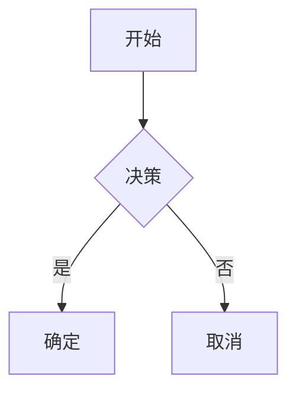

# VitePress 图表插件

[English](README.md) | [Español](README.es.md) | [中文](README.zh.md) | [Українська](README.uk.md) | [Русский](README.ru.md)

一个使用 Kroki 服务支持各种图表类型的 VitePress 插件。该插件自动将图表代码块转换为 SVG 图像，在本地缓存，并提供清晰、可自定义的显示效果，支持可选的标题。

使用外部服务需要在构建期间连接互联网，但与在客户端创建图像（包大小巨大和性能下降）和在服务器端创建图像（复杂性 - 例如 mermaid 需要 puppeteer）相比，它提供了显著的优势。

图表是因为以下原因而在 __DEV 时间__ 生成的：

1. 生成过程是异步的。
2. 它不是100%可靠的（例如，kroki.io服务可能会宕机）。
3. 用户需要验证输出。

> `vitepress-plugin-diagrams` CLI 可以在 CI 中使用，以檢查是否有遺漏的圖表或過時的圖表。還有一個 [pre-commit](https://pre-commit.com) 鉤子可用 (請參閱 [預提交部分](#預提交部分)) 。

## 功能特点

- 支持多种图表类型（Mermaid、PlantUML、GraphViz 等）
- 自动生成 SVG 并缓存（生成后本地缓存，直到图表代码更改）
- 可选的图表标题
- 可自定义输出路径
- 清晰的语义化 HTML 输出
- 可以使用任何编辑器创建图表（例如，使用 Mermaid 扩展的 VS Code）


## 安装

```bash
pnpm add -D vitepress-plugin-diagrams
```

<details>
<summary>yarn</summary>

```bash
yarn add -D vitepress-plugin-diagrams
```
</details>

<details>
<summary>npm</summary>

```bash
npm install --save-dev vitepress-plugin-diagrams
```
</details>

## 快速开始

1. 添加到 VitePress 配置（`.vitepress/config.ts`）：

```ts
import { defineConfig } from "vitepress";
import { configureDiagramsPlugin } from "vitepress-plugin-diagrams";

export default defineConfig({
  markdown: {
    config: (md) => {
      configureDiagramsPlugin(md, {
        diagramsDir: "docs/public/diagrams", // 可选：自定义 SVG 文件目录
        publicPath: "/diagrams", // 可选：自定义公共路径
        krokiServerUrl: "https://kroki.io", // 可选：自定义 Kroki 服务器地址
      });
    },
  },
});
```

2. 在 Markdown 中创建图表:

````

<!-- diagram id="1" caption: "系统流程图" -->
````

## 图表元数据

图表元数据功能提供额外的上下文和标识。您可以使用特殊的 HTML 注释为图表添加元数据。

```html
<!-- diagram id="1" caption: "系统流程图" -->
```

- 为每个图表分配唯一 ID 以防止缓存膨胀（可选，如果不修改和重新生成图表）
- 在图表下添加描述性说明（可选）

标识符说明：

- 如果省略 `id`，插件会基于 Markdown 文件名和代码块索引自动推导出一个稳定的基于位置的标识符（`positionId`）。这会让文件名在重建间保持稳定，除非图表在文件中移动。
- 如果既不能使用 `id` 也不能使用位置，文件名将回退为仅使用内容哈希的形式。

## 支持的图表类型

Mermaid、PlantUML、GraphViz、BlockDiag、BPMN、Bytefield、SeqDiag、ActDiag、NwDiag、PacketDiag、RackDiag、C4（使用 PlantUML）、D2、DBML、Ditaa、Erd、Excalidraw、Nomnoml、Pikchr、Structurizr、Svgbob、Symbolator、TikZ、UMlet、Vega、Vega-Lite、WaveDrom、WireViz

[查看完整支持的图表列表 →](https://kroki.io/#support)

## 配置选项

| 选项 | 类型 | 默认值 | 描述 |
|--------|------|---------|-------------|
| `diagramsDir` | `string` | `"docs/public/diagrams"` | SVG 文件存储目录 |
| `publicPath` | `string` | `"/diagrams"` | 文件访问的公共路径 |
| `krokiServerUrl` | `string` | `"https://kroki.io"` | Kroki 服务器地址 |

## 输出结构

```html
<figure class="vpd-diagram vpd-diagram--[diagramType]">
  
  <figcaption class="vpd-diagram-caption">
    [caption]
  </figcaption>
</figure>
```

您可以自定义 `CSS` 类以匹配您的主题。

## 文件名模式与缓存行为

为确保稳定的文件命名和避免缓存污染，插件按以下优先级生成文件名：

- 显式 `id`：`[diagramType]-[id]-[hash].svg`
- 基于位置的 `positionId`：`[diagramType]-[positionId]-[hash].svg`
- 无标识符：`[diagramType]-[hash].svg`

缓存清理机制：

- 当使用显式 `id` 时，插件会在内容变化时自动清理同一 `id` 的旧文件。
- 当使用 `positionId` 时，插件会在内容变化时自动清理同一位置的旧文件（不同内容哈希）。
- 当没有任何标识符时，插件会在内容变化时自动清理同类型且无标识符的旧文件（`[diagramType]-[hash].svg`）。

这样可以使文件名在重建间保持可读与稳定，并在图表更新时保持输出目录整洁。

## 預提交部分

將此新增至您的 `.pre-commit-config.yaml`：

```yaml
- repo: https://github.com/vuesence/vitepress-plugin-diagrams
  rev: "main"
  hooks:
    - id: check-missing-diagrams
    - id: clean-diagrams
```

## 注意

当更新图表时，您可能会在浏览器页面中看到 placeholder 图像。这是正常的，因为 SVG 文件是异步加载的，可能不会立即显示。只需刷新页面。

## 许可证

MIT

## 贡献

欢迎贡献！在提交 Pull Request 之前，请先创建 issue 讨论您想要进行的更改。

## 致谢

本插件使用 [Kroki](https://kroki.io/) 服务生成图表。
