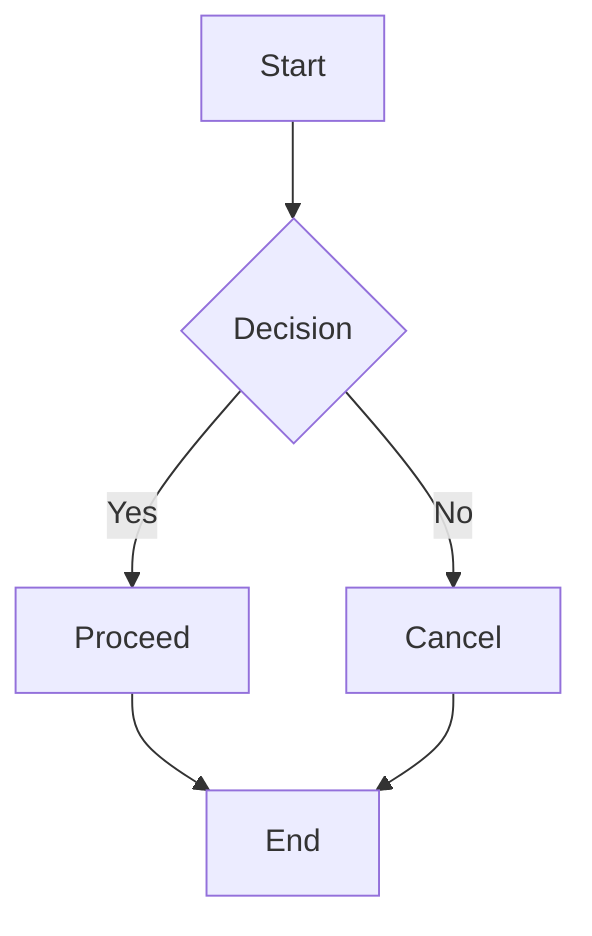
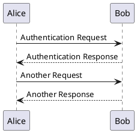
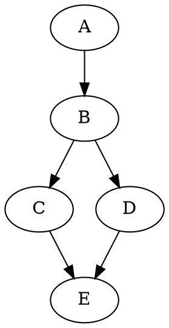

# Inline Diagrams

This page demonstrates traditional **inline diagram** syntax - writing diagram code directly in your markdown files.

## Mermaid Diagram


<!-- diagram id="inline-mermaid-1" caption: "Simple Flow Chart" -->

## PlantUML Diagram


<!-- diagram id="inline-plantuml-1" caption: "Sequence Diagram" -->

## BPMN Diagram (Inline)

```bpmn
<?xml version="1.0" encoding="UTF-8"?>
<bpmn:definitions xmlns:bpmn="http://www.omg.org/spec/BPMN/20100524/MODEL" xmlns:di="http://www.omg.org/spec/DD/20100524/DI" xmlns:dc="http://www.omg.org/spec/DD/20100524/DC" xmlns:bpmndi="http://www.omg.org/spec/BPMN/20100524/DI">
  <bpmn:process id="simple-process" isExecutable="false">
    <bpmn:startEvent id="start"/>
    <bpmn:task id="task"/>
    <bpmn:endEvent id="end"/>
    <bpmn:sequenceFlow id="f1" sourceRef="start" targetRef="task"/>
    <bpmn:sequenceFlow id="f2" sourceRef="task" targetRef="end"/>
  </bpmn:process>
  <bpmndi:BPMNDiagram id="diag">
    <bpmndi:BPMNPlane id="plane" bpmnElement="simple-process">
      <bpmndi:BPMNShape id="start_di" bpmnElement="start"><dc:Bounds x="100" y="100" width="36" height="36"/></bpmndi:BPMNShape>
      <bpmndi:BPMNShape id="task_di" bpmnElement="task"><dc:Bounds x="200" y="78" width="100" height="80"/></bpmndi:BPMNShape>
      <bpmndi:BPMNShape id="end_di" bpmnElement="end"><dc:Bounds x="350" y="100" width="36" height="36"/></bpmndi:BPMNShape>
    </bpmndi:BPMNPlane>
  </bpmndi:BPMNDiagram>
</bpmn:definitions>
```
<!-- diagram id="inline-bpmn-1" caption: "Inline BPMN Process" -->

## GraphViz Diagram


<!-- diagram id="inline-graphviz-1" caption: "Dependency Graph" -->

---

**Next:** See how to import these diagrams from external files on the [File Imports](/file-imports) page.
